<br><br>

<!-- Contents -->
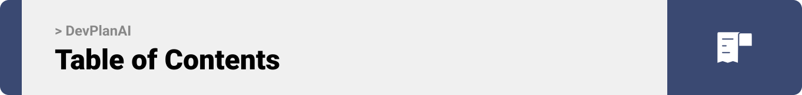

### Contents

- #### [Project Philosophy and Description](#project-desciption)
- #### [User Stories and Types](#user-stories)
- #### [Design and Prototyping](#prototyping)
- #### [Tech Stack](#tech-stack)
- #### [Demo](#demo)
- #### [APIs' Performance](#performance)
- #### [How to Run](#prerequisites)

<br><br>

<!-- project philosophy -->

<a name="project-philosophy"></a>


### Project Desciption

> A Website for developers and project managers that helps them generate their task schedule based on AI where it generates project tasks schedule.
>
> DevPlanAI aims to make it easier for developers and project managers to develop their project schedule to best handle the development process. With the Title, Deadline, Type and a small description the project schedule is generated

### User Stories

Project Manager:

As a project manager, I want to generate the tasks of my project based on its name and other details so that I can benefit from these tasks to manage my project.
As a project manager, I want to adjust the tasks timing created by the AI model in order to match fully my requirements and needs.
As a project manager, I want to create my team so that I can assign generated tasks for them.
As a project manager, I want to track the progress of production so that I can manage done tasks and undergoing tasks.
As a project manager, I want to access all of my projects undergoing and done so I can benefit from previous experience.
Developer:

As a developer, I want to generate my own project schedule so that my tasks can be organized and clear.
As a developer, I want to adjust the timings of my tasks generated by the AI model so that it suits my needs the most.
As a developer, I want to track the progress of production of my software so I can manage my priorities and time efficiently.
Super Admin:

As a super admin of the website, I want to access all users and projects so that I can manage appropriate projects and users and obtain stats on project names.

User
dashes not points
ChatGPT
Certainly, here are the user stories with dashes:

#### Project Manager:

- As a project manager, I want to generate the tasks of my project based on its name and other details so that I can benefit from these tasks to manage my project.
- As a project manager, I want to adjust the tasks timing created by the AI model in order to match fully my requirements and needs.
- As a project manager, I want to create my team so that I can assign generated tasks for them.
- As a project manager, I want to track the progress of production so that I can manage done tasks and undergoing tasks.
- As a project manager, I want to access all of my projects undergoing and done so I can benefit from previous experience.

#### Developer:

- As a developer, I want to generate my own project schedule so that my tasks can be organized and clear.
- As a developer, I want to adjust the timings of my tasks generated by the AI model so that it suits my needs the most.
- As a developer, I want to track the progress of production of my software so I can manage my priorities and time efficiently.

#### Super Admin:

- As a super admin of the website, I want to access all users and projects so that I can manage appropriate projects and users and obtain stats on project names.

<br><br>

<!-- Prototyping -->

<a name="prototyping"></a>


### Prototyping

> We designed DevPlanAI using wireframes and mockups, iterating on the design until we reached the ideal layout for easy navigation and a seamless user experience.

### Sample WireFrames

| My Contribution Requests                            | Admin Users screen                               |
| --------------------------------------------------- | ------------------------------------------------ |
| 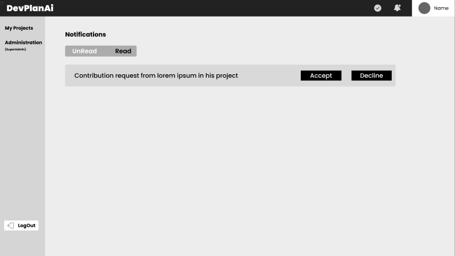 | 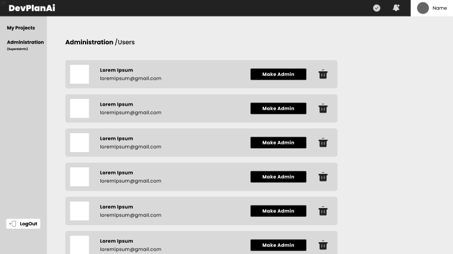 |

### Sample Mockups

| Dashboard Mockup                               | My Projects Mockup screen                     |
| ---------------------------------------------- | --------------------------------------------- |
| 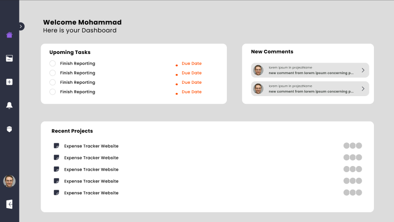 | 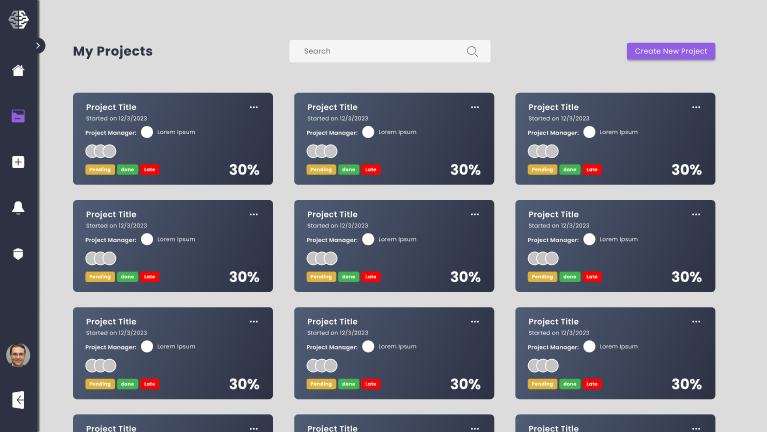 |

<br><br>

<!-- Tech stack -->

<a name="stacks"></a>

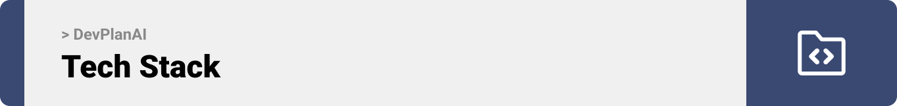

### Tech Stack

#### DevPlanAI is built using the following technologies:

- This project uses the [Laravel](https://laravel.com/) for the backend and [React](https://react.dev/) for the FrontEnd. Laravel is a popular open-source PHP web application framework designed for building modern, robust, and scalable web applications.

- For persistent storage (database), the website uses [MySQL](https://www.mysql.com/). MySQL is an open-source relational database management system (RDBMS) that is widely used for managing and storing data. It is known for its speed, reliability, and ease of use, and it has become one of the most popular database systems in the world. MySQL is often used in web applications, content management systems (CMS), e-commerce platforms, and many other types of software applications.
- The app uses the font ["Poppins"](https://fonts.google.com/specimen/Poppins) as its main font, and the design of the app adheres to the material design guidelines.

<!-- Implementation -->

<a name="demo"></a>


### Demo

> Using the wireframes and mockups as a guide, we implemented the DevPlanAI app with the following features:

### Sample Screens

| Login screen                                 | Register screen                             |
| -------------------------------------------- | ------------------------------------------- |
|           |         |
| My Projects screen                           | Generate Project Screen                     |
|      |  |
| Dashboard screen                             | Task Overview Screen                        |
|         |     |
| Add Contributor screen                       | Notification Screen                         |
|  |    |
| Admin Screen - Projects                      | Admin Screen - Users                        |
|  | 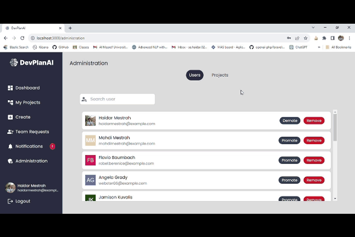     |
| Profile Screen                               |
|       |

<br><br>

<!-- Performance -->

<a name="performance"></a>

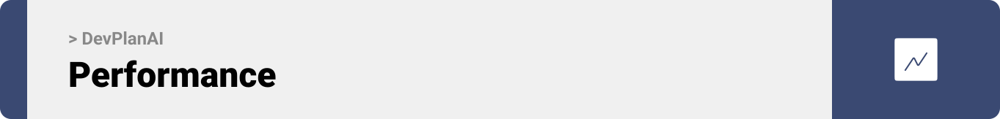

### Performance

> Using Laravel's eloquent models and efficiency in the controller functions here are few performance results directed from postman

#### Performance testing with Postman

| Login function                                                | Register function                                           |
| ------------------------------------------------------------- | ----------------------------------------------------------- |
| 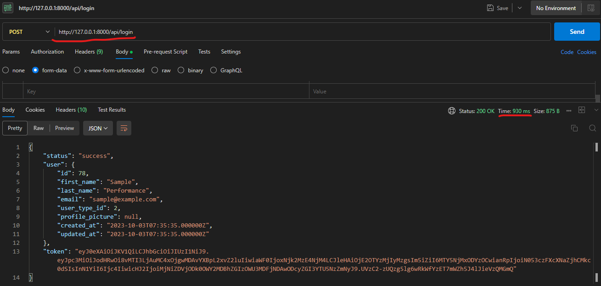         | 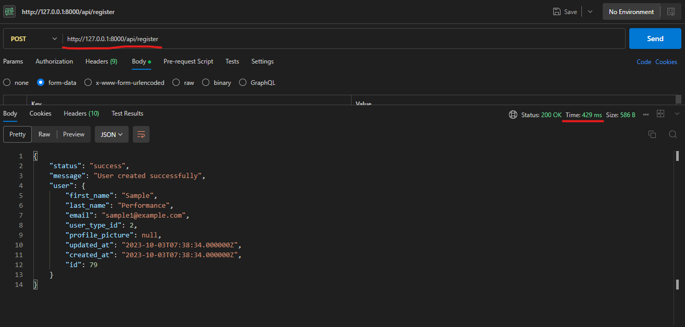      |
| Get Projects function                                         | Accept Generated Project function                           |
| 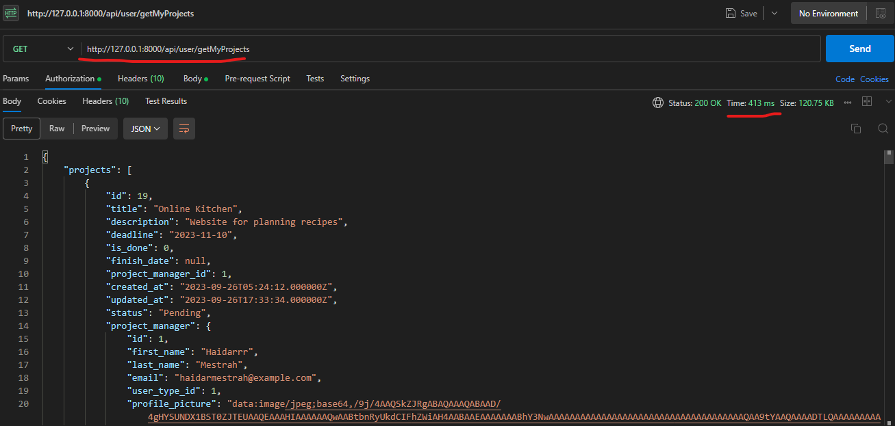 | 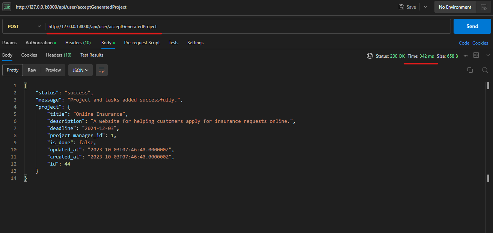 |

<br><br>

<!-- How to run -->

<a name="running"></a>


> To set up DevPlanAI locally, follow these steps:

### Prerequisites

You need to ensure that [XAMPP](https://www.apachefriends.org/), [Composer](https://getcomposer.org/download/) and [MySQL](https://dev.mysql.com/downloads/installer/) are installed on your device.

If not installed follow the links above to install them.

- verify you have the latest version of npm by executing the following command
  ```sh
  npm install npm@latest -g
  ```

### Installation

_Start Appache server and MySQL from XAMPP_

1. Clone the repo

   ```sh
   git clone https://github.com/Haidar-02/DevPlanAI.git
   ```

2. Open [phpMyAdmin](http://localhost/phpmyadmin/) and create a database called `devplanai_db`

3. Open the project in [VS Code](https://code.visualstudio.com/), change the name of the database to devplanai_db at the `server` directory in the `.env` file

   ```js
   DB_DATABASE = devplanai_db;
   ```

4. Right click on the server and run in integrated terminal. Execute the following commands

   ```sh
   composer install

   php artisan migrate

   php artisan jwt:secret
   ```

5. Enter your OpenAI Key in `.env` file

   ```js
   OPENAI_API_KEY = "sk-...";
   ```

6. Start your server by running the following in your terminal
   ```sh
   php artisan serve
   ```

Now, your server is running locally. To run the website:

6. Right click on the `client` folder and open in an integrated terminal. Execute the following:

   ```sh
   npm install

   npm start
   ```

Now, DevPlanAI must launch successfully in your browser. Enjoy your scheduling with AI !
